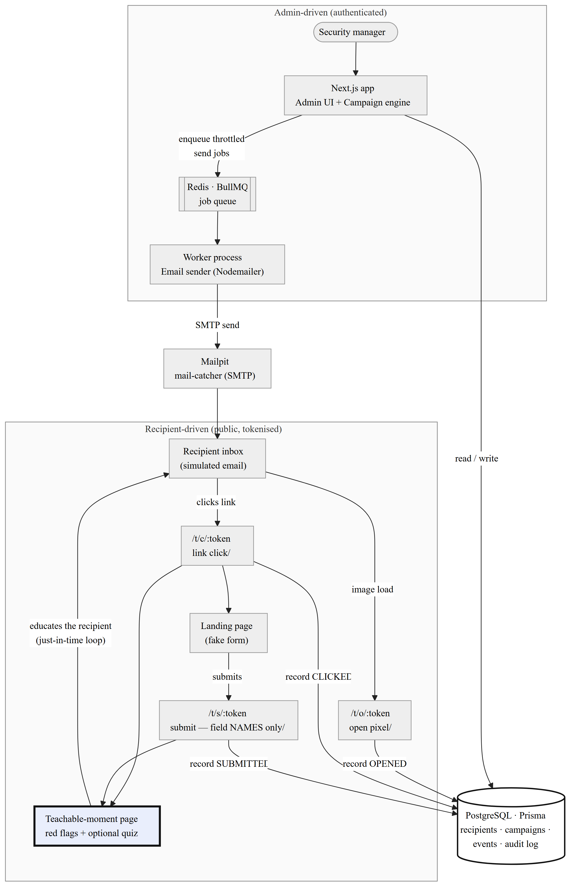

# Architecture

This document describes Phlare's components, data flow, and the justification for
each technology choice. It maps to the thesis chapter on architecture and
implementation.

## 1. Component overview



*(Figure 4 — regenerate with `npm run diagrams`.)*

Phlare is one Next.js application plus one background worker, backed by
PostgreSQL, Redis, and (for the demo) Mailpit. There are two clear bands:

- **Admin-driven (authenticated).** The Security Manager uses the Next.js admin
  UI / campaign engine. Launching a campaign enqueues throttled send jobs onto
  Redis/BullMQ; the worker process sends them via SMTP.
- **Recipient-driven (public, tokenised).** Recipients receive the simulated
  email and interact with tokenised tracking endpoints (open pixel, click,
  submit). Every interaction is recorded once (idempotently) and always ends on
  the **teachable-moment page** — the just-in-time learning loop.

| Component | Process / container | Responsibility |
|---|---|---|
| Web app | `web` | Admin UI, API route handlers, public tracking routes |
| Worker | `worker` | Sending, scheduled launches, retention cleanup (BullMQ) |
| PostgreSQL | `postgres` | System of record |
| Redis | `redis` | Job queue backing store |
| Mailpit | `mailpit` | Local SMTP sink for demos/evaluation |

## 2. Technology choices & justification

A condensed rationale (full trade-off analysis in [`../DECISIONS.md`](../DECISIONS.md)):

- **Next.js 15 (App Router) + TypeScript** — one framework for SSR admin pages,
  API handlers, and the public tracking routes; server components keep DB access
  on the server and pages clean and accessible.
- **Separate worker process** — sending is long-running and must not block HTTP
  handlers; same codebase/image keeps types and the Prisma client shared (D1).
- **Server-side sessions, argon2id** — instant revocation, simpler CSRF,
  hash-only storage; memory-hard password hashing (D2, D3).
- **PostgreSQL + Prisma** — relational integrity for a strongly-related domain;
  schema-generated ERD that cannot drift (D5).
- **BullMQ + Redis** — delayed jobs, retries, and a built-in rate limiter that
  implements campaign throttling (D4).
- **Nodemailer + Mailpit** — standard SMTP sending; a local catcher makes the
  full simulation demonstrable without a live mail server.
- **Zod** — one validation schema shared by client and server.

## 3. Request / data flows

The end-to-end send → open → click → submit → teach flow is implemented across
Phases 1–5. A dedicated sequence diagram for that flow will be added to
`docs/diagrams/` in Phase 4 when the tracking endpoints land.

Phase 1 establishes the spine of this architecture: the authenticated app shell
and guards, the data layer, the worker/queue wiring, and the containerised stack.

## 4. Project structure

```
src/
  app/            Next.js routes — (auth), setup, (admin), t/ (public tracking), api/
  server/         Framework-agnostic backend logic
    auth/         password hashing, sessions, lockout, route guard
    crypto/       AES-256-GCM for secrets at rest
    settings/     singleton settings + setup-state helpers
    audit/        audit-log helper
    db.ts         Prisma client singleton
  worker/         BullMQ entrypoint + queue definitions
  lib/            env access, shared Zod schemas
  components/     shared UI (grows in later phases)
prisma/           schema.prisma, migrations, seed
docs/             architecture, schema, security, risk-scoring, evaluation, diagrams
scripts/          render-diagrams.mjs, demo harness (Phase 7)
```

## 5. Security posture (summary)

Detailed in [`security.md`](security.md). Highlights wired in Phase 1: argon2id
hashing, login lockout, hash-only session storage, secrets encrypted at rest,
security response headers, and audit logging of sensitive actions.
