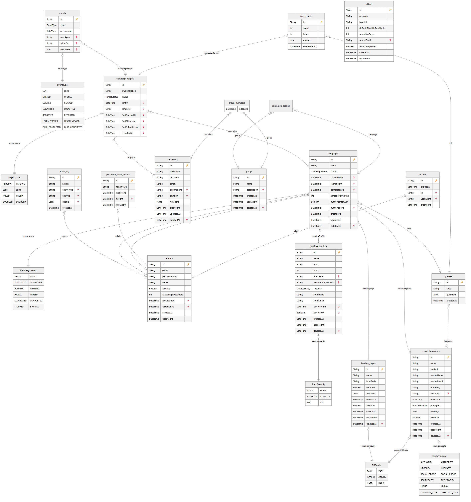

# Database Schema

The authoritative source is [`../prisma/schema.prisma`](../prisma/schema.prisma).
The ERD below is generated **from that schema** (so it cannot drift) via
`npm run diagrams`.

*(ERD — see `diagrams/erd.svg` for a zoomable vector version.)*

## Entities

### Authentication
- **admins** — the only authenticated user type. Holds the argon2id
  `passwordHash`, plus `failedLoginAttempts` / `lockedUntil` for brute-force
  protection.
- **sessions** — server-side sessions. PK is `sha256(token)`; the raw token lives
  only in the cookie.
- **password_reset_tokens** — single-use, hashed, expiring reset tokens.

### Recipients & grouping
- **recipients** — target employees (never log in). Soft-deleted (`deletedAt`) so
  campaign history survives. Carries a cached `riskScore`.
- **groups** / **group_members** — many-to-many grouping for targeting (by
  department or custom group).

### Content
- **email_templates** — simulated emails. Carries a `difficulty`, a Cialdini
  `principle`, and a structured `redFlags` list that drives the teachable-moment
  page. `isBuiltin` marks the seeded library.
- **landing_pages** — the tracked-link destination. `fieldDefs` describes the
  form **field names only** — values are never stored.
- **quizzes** / **quiz_results** — optional knowledge-check after the teachable
  moment; results store selected option indices only (no PII).

### Sending
- **sending_profiles** — SMTP configuration. `passwordCiphertext` is AES-256-GCM
  encrypted; plaintext is never persisted.

### Campaign engine
- **campaigns** — ties together template + landing page + sending profile (+
  optional quiz), with lifecycle `status`, scheduling, throttle, and the
  **authorization gate** (`authorizationAck` / `authorizedBy` / `authorizedAt`).
- **campaign_groups** — which groups a campaign targets.
- **campaign_targets** — one row per (campaign, recipient); holds the unique
  `trackingToken` and denormalised first-event timestamps for idempotency and
  cheap analytics.

### Tracking & governance
- **events** — append-only event log (`SENT`, `OPENED`, `CLICKED`, `SUBMITTED`,
  `REPORTED`, `LEARN_VIEWED`, `QUIZ_COMPLETED`). For `SUBMITTED`, `metadata`
  holds field **names only**. `userAgent` is truncated and IP, if any, is coarse
  (data minimisation).
- **settings** — singleton (`id = "singleton"`): org name, base URL, default
  throttle, retention period, report email.
- **audit_log** — actor + action + entity for sensitive admin operations.

## Key design points

- **Idempotency.** First-event timestamps on `campaign_targets` make repeated
  pixel/click hits count once; `events` keeps the full history.
- **Data minimisation (Section 7).** No submitted values; truncated UA; coarse/
  optional IP; configurable retention (`settings.retentionDays`).
- **Indexing.** Hot paths are indexed: `events(campaignTargetId, type)` and
  `events(occurredAt)` for time-series; `campaign_targets.status`;
  `recipients.deletedAt`; `audit_log.createdAt`.

## Migrations

The initial migration is `prisma/migrations/<timestamp>_init`. Apply with
`npm run prisma:migrate` (dev) or `npm run prisma:deploy` (prod; the `web`
container runs this automatically on start).
