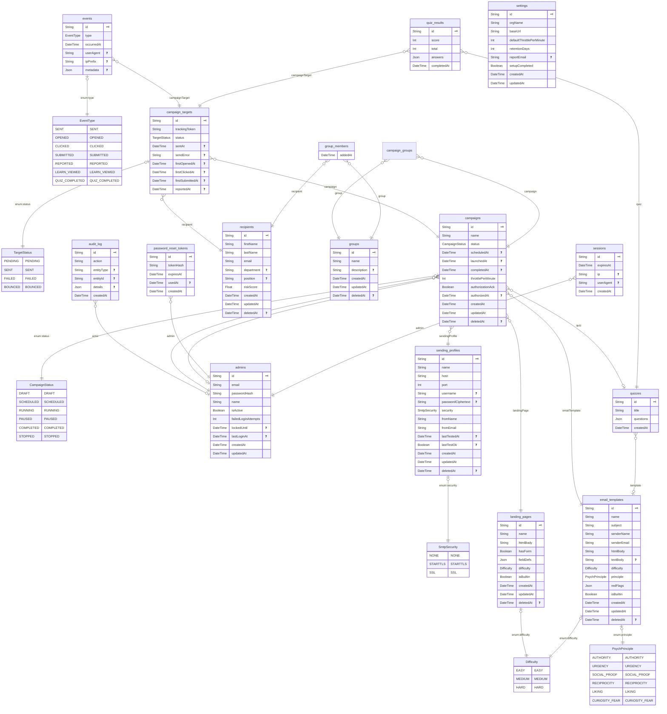

```mermaid
erDiagram

        Difficulty {
            EASY EASY
MEDIUM MEDIUM
HARD HARD
        }
    


        PsychPrinciple {
            AUTHORITY AUTHORITY
URGENCY URGENCY
SOCIAL_PROOF SOCIAL_PROOF
RECIPROCITY RECIPROCITY
LIKING LIKING
CURIOSITY_FEAR CURIOSITY_FEAR
        }
    


        SmtpSecurity {
            NONE NONE
STARTTLS STARTTLS
SSL SSL
        }
    


        CampaignStatus {
            DRAFT DRAFT
SCHEDULED SCHEDULED
RUNNING RUNNING
PAUSED PAUSED
COMPLETED COMPLETED
STOPPED STOPPED
        }
    


        TargetStatus {
            PENDING PENDING
SENT SENT
FAILED FAILED
BOUNCED BOUNCED
        }
    


        EventType {
            SENT SENT
OPENED OPENED
CLICKED CLICKED
SUBMITTED SUBMITTED
REPORTED REPORTED
LEARN_VIEWED LEARN_VIEWED
QUIZ_COMPLETED QUIZ_COMPLETED
        }
    
  "admins" {
    String id "🗝️"
    String email 
    String passwordHash 
    String name 
    Boolean isActive 
    Int failedLoginAttempts 
    DateTime lockedUntil "❓"
    DateTime lastLoginAt "❓"
    DateTime createdAt 
    DateTime updatedAt 
    }
  

  "sessions" {
    String id "🗝️"
    DateTime expiresAt 
    String ip "❓"
    String userAgent "❓"
    DateTime createdAt 
    }
  

  "password_reset_tokens" {
    String id "🗝️"
    String tokenHash 
    DateTime expiresAt 
    DateTime usedAt "❓"
    DateTime createdAt 
    }
  

  "recipients" {
    String id "🗝️"
    String firstName 
    String lastName 
    String email 
    String department "❓"
    String position "❓"
    Float riskScore 
    DateTime createdAt 
    DateTime updatedAt 
    DateTime deletedAt "❓"
    }
  

  "groups" {
    String id "🗝️"
    String name 
    String description "❓"
    DateTime createdAt 
    DateTime updatedAt 
    DateTime deletedAt "❓"
    }
  

  "group_members" {
    DateTime addedAt 
    }
  

  "email_templates" {
    String id "🗝️"
    String name 
    String subject 
    String senderName 
    String senderEmail 
    String htmlBody 
    String textBody "❓"
    Difficulty difficulty 
    PsychPrinciple principle 
    Json redFlags 
    Boolean isBuiltin 
    DateTime createdAt 
    DateTime updatedAt 
    DateTime deletedAt "❓"
    }
  

  "landing_pages" {
    String id "🗝️"
    String name 
    String htmlBody 
    Boolean hasForm 
    Json fieldDefs 
    Difficulty difficulty 
    Boolean isBuiltin 
    DateTime createdAt 
    DateTime updatedAt 
    DateTime deletedAt "❓"
    }
  

  "quizzes" {
    String id "🗝️"
    String title 
    Json questions 
    DateTime createdAt 
    }
  

  "quiz_results" {
    String id "🗝️"
    Int score 
    Int total 
    Json answers 
    DateTime completedAt 
    }
  

  "sending_profiles" {
    String id "🗝️"
    String name 
    String host 
    Int port 
    String username "❓"
    String passwordCiphertext "❓"
    SmtpSecurity security 
    String fromName 
    String fromEmail 
    DateTime lastTestedAt "❓"
    Boolean lastTestOk "❓"
    DateTime createdAt 
    DateTime updatedAt 
    DateTime deletedAt "❓"
    }
  

  "campaigns" {
    String id "🗝️"
    String name 
    CampaignStatus status 
    DateTime scheduledAt "❓"
    DateTime launchedAt "❓"
    DateTime completedAt "❓"
    Int throttlePerMinute 
    Boolean authorizationAck 
    DateTime authorizedAt "❓"
    DateTime createdAt 
    DateTime updatedAt 
    DateTime deletedAt "❓"
    }
  

  "campaign_groups" {

    }
  

  "campaign_targets" {
    String id "🗝️"
    String trackingToken 
    TargetStatus status 
    DateTime sentAt "❓"
    String sendError "❓"
    DateTime firstOpenedAt "❓"
    DateTime firstClickedAt "❓"
    DateTime firstSubmittedAt "❓"
    DateTime reportedAt "❓"
    }
  

  "events" {
    String id "🗝️"
    EventType type 
    DateTime occurredAt 
    String userAgent "❓"
    String ipPrefix "❓"
    Json metadata "❓"
    }
  

  "settings" {
    String id "🗝️"
    String orgName 
    String baseUrl 
    Int defaultThrottlePerMinute 
    Int retentionDays 
    String reportEmail "❓"
    Boolean setupCompleted 
    DateTime createdAt 
    DateTime updatedAt 
    }
  

  "audit_log" {
    String id "🗝️"
    String action 
    String entityType "❓"
    String entityId "❓"
    Json details "❓"
    DateTime createdAt 
    }
  
    "sessions" }o--|| admins : "admin"
    "password_reset_tokens" }o--|| admins : "admin"
    "group_members" }o--|| groups : "group"
    "group_members" }o--|| recipients : "recipient"
    "email_templates" |o--|| "Difficulty" : "enum:difficulty"
    "email_templates" |o--|| "PsychPrinciple" : "enum:principle"
    "landing_pages" |o--|| "Difficulty" : "enum:difficulty"
    "quizzes" }o--|o email_templates : "template"
    "quiz_results" }o--|| quizzes : "quiz"
    "quiz_results" }o--|| campaign_targets : "campaignTarget"
    "sending_profiles" |o--|| "SmtpSecurity" : "enum:security"
    "campaigns" |o--|| "CampaignStatus" : "enum:status"
    "campaigns" }o--|| email_templates : "emailTemplate"
    "campaigns" }o--|| landing_pages : "landingPage"
    "campaigns" }o--|| sending_profiles : "sendingProfile"
    "campaigns" }o--|o quizzes : "quiz"
    "campaigns" }o--|o admins : "authorizedBy"
    "campaigns" }o--|| admins : "createdBy"
    "campaign_groups" }o--|| campaigns : "campaign"
    "campaign_groups" }o--|| groups : "group"
    "campaign_targets" }o--|| campaigns : "campaign"
    "campaign_targets" }o--|| recipients : "recipient"
    "campaign_targets" |o--|| "TargetStatus" : "enum:status"
    "events" }o--|| campaign_targets : "campaignTarget"
    "events" |o--|| "EventType" : "enum:type"
    "audit_log" }o--|o admins : "actor"
```
